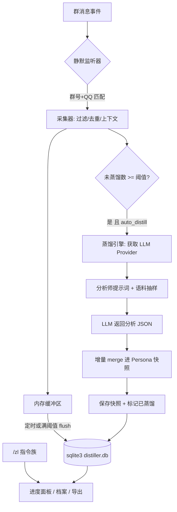

# 我要蒸馏群友 · astrbot_plugin_group_distiller

> 把一个指定的群友，「蒸馏」成一份带证据来源、可持续增量更新的 **5 层 AI 人格档案**。

灵感来自 [pig-skill](https://github.com/Neko-Suwako/pig-skill)（5 层 Persona 结构 + 增量 merge + 纠正层）与 [colleague-skill](https://github.com/Neko-Suwako/colleague-skill)。本插件是它的 **AstrBot 插件版**：静默采集语料 → LLM 蒸馏 → 群内可查进度。

> ⚠️ **仅供娱乐与技术学习**。本插件会分析真人聊天记录，请务必在采集前取得当事人知情同意，**严禁用于侵犯隐私、人肉、歧视或骚扰**。使用者需自行承担一切合规责任。

---

## ✨ 功能特性

- 🤫 **静默采集**：悄悄记录目标群友的发言，绝不打断机器人正常聊天（不回复、不 yield、不 stop）。
- 🧩 **5 层 Persona 结构**：硬规则 / 身份 / 表达风格 / 聊天行为模式 / 兴趣偏好。
- 🔁 **增量蒸馏**：攒够语料自动触发，或手动 `/zl distill`；新证据只做补充加权，**不推翻**已有高置信结论。
- 🪪 **证据溯源**：每条结论都带「证据条数 + 代表性原话」。
- 🧑‍⚖️ **人工纠正层**：`/zl correct` 写入的纠正优先级高于 LLM 推断，永久生效。
- 📊 **群内进度面板**：`/zl` 一条指令看语料量、进度条、蒸馏轮次、档案完整度。
- 📤 **一键导出**：`/zl export` 生成 `persona_<QQ>.md` 到数据目录。
- 🧱 **零第三方依赖**：只用 Python 标准库（`sqlite3` / `asyncio`）+ AstrBot 本体，安装失败率极低。

---

## 📦 安装方法

1. 确保你的 AstrBot 已安装并运行，且机器人平台为 **aiocqhttp（QQ）**。
2. 进入 AstrBot 的插件目录（通常是 `<AstrBot>/data/plugins/`），克隆本仓库：

   ```bash
   cd AstrBot/data/plugins
   git clone https://github.com/Shawlei/astrbot_plugin_group_distiller.git
   ```

3. 重启 AstrBot，或在 WebUI 插件管理页重载插件。
4. 打开 WebUI → 插件配置，按需填写下方字段。

> 本插件**不需要** `pip install` 任何东西，也**不需要**虚拟环境。

---

## ⚙️ WebUI 配置说明

| 字段 | 类型 | 默认 | 说明 |
| --- | --- | --- | --- |
| `enabled` | bool | `true` | 插件总开关，关掉则采集与指令全停。 |
| `target_group_id` | string | `""` | 目标群号。也可进群用 `/zl set` 现场设定。 |
| `target_qq_id` | string | `""` | 目标群友 QQ 号（纯数字）。 |
| `target_nickname` | string | `""` | 目标昵称，用于提示词与展示，可留空。 |
| `listen_enabled` | bool | `true` | 静默采集开关。 |
| `auto_distill` | bool | `true` | 攒够语料自动蒸馏；关掉可改手动。 |
| `distill_interval_messages` | int | `200` | 每累计这么多条未蒸馏语料触发一轮。 |
| `distill_batch_messages` | int | `300` | 单轮最多投喂多少条语料。 |
| `saturation_messages` | int | `1500` | 进度条攒满所需的语料基准。 |
| `min_message_length` | int | `1` | 比它短的消息丢弃（`0` 表示不过滤）。 |
| `ignore_commands` | bool | `true` | 忽略以 `/` 开头的指令消息。 |
| `record_context` | bool | `true` | 额外记录目标消息前后各 1 条相邻消息（帮助理解语境）。 |
| `llm_provider_id` | string | `""` | 指定 LLM Provider ID，留空用当前会话默认。 |
| `admin_only` | bool | `true` | `/zl` 是否仅管理员可用。 |
| `reply_with_at` | bool | `true` | 进度面板是否 @ 提问者。 |
| `custom_prompt_extra` | text | `""` | 追加到蒸馏提示词的额外约束，如「多关注他吐槽的语气」。 |

---

## 🕹️ `/zl` 指令表

| 指令 | 行为 |
| --- | --- |
| `/zl` | 展示进度面板（默认） |
| `/zl on` / `/zl off` | 开启 / 关闭采集 |
| `/zl set <群号> <QQ号>` | 设定目标（也支持 `/zl set <QQ号>`，用当前群） |
| `/zl now` | 查看当前目标 |
| `/zl distill` | 手动触发一轮蒸馏（异步，立即回复「已开始」） |
| `/zl profile` | 展示当前 Persona 摘要（5 层每层 3~5 行） |
| `/zl export` | 导出 `persona_<QQ>.md` 到数据目录，回复路径 + 内容预览 |
| `/zl correct <内容>`（别名 `/zl 纠正 <内容>`） | 追加人工纠正条目 |
| `/zl reset confirm` | 二次确认后清空该目标语料 |
| `/zl help`（别名 `/zl 帮助`） | 帮助文本 |

> 指令别名：`/蒸馏` 等价于 `/zl`。子命令均手动解析，`/zl set 1 2`、`/zl  set 1 2`、前缀被剥离后的 `set 1 2` 均可正确识别。

---

## 📊 进度面板示例

```
🧪 群友蒸馏进度 · 我要蒸馏群友
──────────────────────────
👤 目标    张三 (123456789)
👥 群聊    目标群 (987654321)
🎚 状态    🟢 待命  |  采集：开启
📦 语料    1,284 条  [████████░░] 80%
🔁 蒸馏    3 轮 · 上次 09-16 14:20 · 排队 84 条待蒸馏
📅 跨度    09-01 ~ 09-16（15 天）
🧩 档案    完整度 62% · 已成型 3/5 层
──────────────────────────
💡 /zl profile 看档案 · /zl help 看全部指令
```

---

## 🧬 Persona 5 层结构

| 层 | 名称 | 内容 |
| --- | --- | --- |
| Layer 1 | 硬规则 | 不可违背的铁律：口头禅、说话长度上限、绝不出现的行为 |
| Layer 2 | 身份 | 昵称、年龄段、性别倾向、职业、身份感、自我称呼 |
| Layer 3 | 表达风格 | 语气、句长、标点习惯、口头禅、表情包习惯、错别字习惯、语速感 |
| Layer 4 | 聊天行为模式 | 何时秒回、何时潜水、如何起话头、如何结束话题、吵架/吐槽方式、称呼他人的方式 |
| Layer 5 | 兴趣偏好 | 话题清单、黑话、梗、活跃时段、雷点 |

额外维护：

- `evidence`：每条结论的证据条数 + 代表性原话（最多 3 条）
- `corrections`：人工纠正层（`/zl 纠正 <内容>`），优先级**高于** LLM 推断
- `meta`：总语料数、去重后条数、时间跨度、蒸馏轮次、最后蒸馏时间、档案完整度（0~100）

---

## 🗂️ 目录结构

```
astrbot_plugin_group_distiller/
├── metadata.yaml          # 插件元信息
├── main.py                # 插件入口：指令族 + 静默监听
├── _conf_schema.json      # WebUI 配置 Schema
├── requirements.txt       # 仅标准库，无第三方依赖
├── README.md
├── LICENSE                # MIT
├── .gitignore
├── core/
│   ├── __init__.py        # 子包导出
│   ├── storage.py         # sqlite3 异步存储层
│   ├── collector.py       # 静默采集器
│   ├── distiller.py       # 蒸馏引擎 + 增量 merge
│   ├── prompts.py         # 5 层结构与提示词
│   └── progress.py        # 进度面板 / 档案渲染
└── tests/
    ├── __init__.py
    ├── test_core.py       # 纯逻辑单元测试（不依赖 AstrBot）
    └── test_qa_verify.py  # QA 独立复核用例（边界 / 并发 / 落盘路径 / 权限）
```

跑测试（无需 AstrBot 环境、无需 pytest）：

```bash
python tests/test_core.py        # 9/9
python tests/test_qa_verify.py   # 29/29
```

数据落盘位置（遵循 AstrBot 规范，数据放 data 目录）：

```
<AstrBot>/data/plugin_data/astrbot_plugin_group_distiller/distiller.db
```

---

## 🔄 工作原理（Mermaid）



---

## 🔒 隐私与合规提醒

- 本插件会**分析真人的聊天记录**，属于敏感行为。**采集前请取得当事人知情同意。**
- 本插件**仅供娱乐**，请勿用于侵犯他人隐私、人肉搜索、歧视、骚扰或任何违法用途。
- LLM 推断结果**可能不准确**，请勿据此对他人做出评价或决策。
- 目标对象有权要求你停止采集并删除数据（`/zl reset confirm` 可清空语料）。
- 请遵守你所在地区关于个人信息保护的法律法规以及 QQ 平台的相关协议。

---

## 🙏 灵感来源致谢

- [pig-skill](https://github.com/Neko-Suwako/pig-skill) —— 5 层 Persona 结构、增量 merge、纠正层设计的直接灵感来源。
- [colleague-skill](https://github.com/Neko-Suwako/colleague-skill) —— 「把某人蒸馏成人格档案」这一玩法的启发。
- [AstrBot](https://github.com/AstrBotDevs/AstrBot) —— 插件运行框架。

感谢上述作者的开源与探索。

---

## 📄 许可证

本项目基于 **MIT License** 开源，版权归 **Shawlei (2026)** 所有。详见 [LICENSE](./LICENSE)。

---

## 🚧 已知限制（样板版）

- **蒸馏为单轮分析**：LLM 只按本次投喂语料给出增量结论，复杂语义冲突依赖 `conflict` 标注而非深度推理。
- **上下文仅前后各 1 条**：更复杂的语境（引用、长对话）暂未建模。
- **无富媒体理解**：图片/表情以 `[图片]` 等占位符记录，不解析图片内容。
- **依赖 LLM 质量**：Provider 能力直接决定档案质量；LLM 调用失败时本轮自动降级跳过。
- **单目标设计**：当前仅支持同时蒸馏一个群友。
- **合并为确定性算法**：为节省 token 未引入二次 LLM 合并，合并规则见 `core/distiller.py`。
