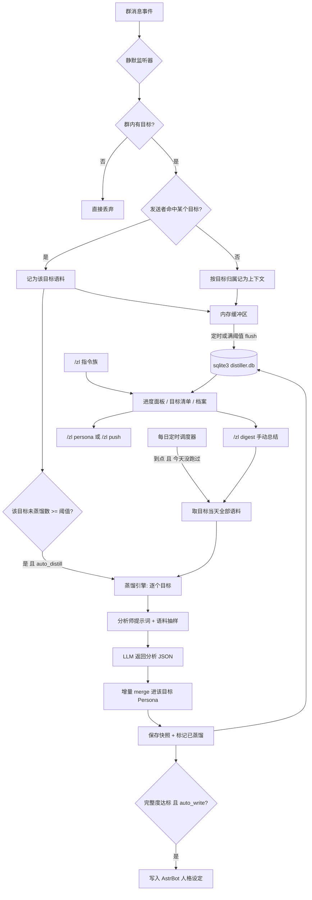

# 我要蒸馏群友 · astrbot_plugin_group_distiller

> 把指定的群友「蒸馏」成一份带证据来源、可持续增量更新的 **5 层 AI 人格档案**，
> 并且可以**一键搬进 AstrBot 的人格设定**，让 bot 用 TA 的方式说话。

灵感来自 [pig-skill](https://github.com/Neko-Suwako/pig-skill)（5 层 Persona 结构 + 增量 merge + 纠正层）与 [colleague-skill](https://github.com/Neko-Suwako/colleague-skill)。本插件是它的 **AstrBot 插件版**：静默采集语料 → LLM 蒸馏 → 群内可查进度 → 写进人格设定。

> ⚠️ **仅供娱乐与技术学习**。本插件会分析真人聊天记录，请务必在采集前取得当事人知情同意，**严禁用于侵犯隐私、人肉、歧视或骚扰**。使用者需自行承担一切合规责任。

---

## ✨ 功能特性

- 👥 **多目标蒸馏**：一个群挂多个群友、多个群各挂几个人，同时进行、互不干扰。上下文按目标归属，不会串台。
- 🤫 **静默采集**：悄悄记录目标群友的发言，绝不打断机器人正常聊天（不回复、不 yield、不 stop）。
- 🧩 **5 层 Persona 结构**：硬规则 / 身份 / 表达风格 / 聊天行为模式 / 兴趣偏好。
- 🔁 **增量蒸馏**：每个目标独立计数，攒够语料自动触发，或手动 `/zl distill`；新证据只做补充加权，**不推翻**已有高置信结论。
- ⏰ **每日定时总结**：打开开关、选个时刻（比如 23:00），每天到点就用目标**当天聊过的全部对话**重新蒸一遍，给档案做当日汇总。到点时 bot 没运行也会补跑；同一天只跑一次。
- 🪪 **证据溯源**：每条结论都带「证据条数 + 代表性原话」。
- 🧑‍⚖️ **人工纠正层**：`/zl correct` 写入的纠正优先级高于 LLM 推断，永久生效。
- 📊 **群内进度面板**：`/zl` 看当前目标，`/zl list` 看全部目标清单。
- 🎛️ **模型选择器**：WebUI 里像选人格一样，从已配好的模型里挑一个专门干蒸馏。
- 🪄 **人格模板**：把 5 层结论组装成 AstrBot 人格提示词，`/zl persona` 复制粘贴，或 `/zl push` **直接写进 AstrBot 的人格设定**；也可以设成档案达标后自动写入。
- 🧱 **零第三方依赖**：只用 Python 标准库（`sqlite3` / `asyncio`）+ AstrBot 本体，安装失败率极低。

---

## 📦 安装方法

1. 确保你的 AstrBot 已安装并运行，且机器人平台为 **aiocqhttp（QQ）**。
2. 进入 AstrBot 的插件目录（通常是 `<AstrBot>/data/plugins/`），克隆本仓库：

   ```bash
   cd AstrBot/data/plugins
   git clone https://github.com/Shawlei/astrbot_plugin_group_distiller.git
   ```

3. 重启 AstrBot，或在 WebUI 插件管理页重载插件。
4. 打开 WebUI → 插件配置，填写目标后保存。

> 本插件**不需要** `pip install` 任何东西，也**不需要**虚拟环境。

### 版本要求

`metadata.yaml` 里声明了 `astrbot_version: ">=4.10.4,<5"`：

| 能力 | 最低版本 | 说明 |
| --- | --- | --- |
| 可视化「蒸馏目标清单」 | v4.10.4 | 用到 `template_list` 配置类型 |
| 「蒸馏用的模型」下拉选择器 | v4.0.0 | 用到 `_special: select_provider` |
| 一键写入 AstrBot 人格 | v4.0.0 | 用到 `Context.persona_manager` |

如果你的 AstrBot 低于 v4.10.4：安装时选「无视警告，继续安装」，然后删掉 `_conf_schema.json` 里的 `targets` 字段，改用下面的 **`targets_text` 纯文本清单**（任何版本都能用）。

---

## ⚙️ WebUI 配置说明

### 🎯 目标怎么填（重点）

支持**两种填法，可以同时用**，会自动合并去重：

**填法一：可视化清单（推荐，需 AstrBot ≥ v4.10.4）**

「蒸馏目标清单」里点按钮加条目，每条填三样：

| 字段 | 必填 | 说明 |
| --- | --- | --- |
| `group_id` | ✅ | TA 所在的群号，纯数字 |
| `qq_id` | ✅ | 被蒸馏群友的 QQ 号，纯数字 |
| `nickname` | ❌ | 备注昵称，填了提示词更准，也方便认人 |

想加几个就加几个。**同一个群两个人**？加两条、群号相同、QQ 不同。
**两个群各两人**？加四条。插件会按「群号 + QQ 号」把它们当成互相独立的目标。

**填法二：纯文本清单（任何版本可用）**

`targets_text` 一行一个目标，格式 `群号 QQ号 [备注昵称]`：

```
# 以 # 开头的行会被当成注释忽略
987654321 123456789 老王
987654321 222222222 小李
555555555 333333333 小张
555555555 444444444
```

分隔符用空格、逗号、顿号、竖线、分号都行；昵称可以带空格（会整段保留）。填错的行不会让插件崩，会在日志里指出是第几行、错在哪。

> 也可以完全不碰配置文件，直接进群发 `/zl add <群号> <QQ号> [昵称]`，运行期用指令加的目标会存进数据库，**优先级高于配置文件**。

### 其余配置项

| 字段 | 类型 | 默认 | 说明 |
| --- | --- | --- | --- |
| `enabled` | bool | `true` | 插件总开关，关掉则采集与指令全停。 |
| `listen_enabled` | bool | `true` | 静默采集开关。 |
| `auto_distill` | bool | `true` | 攒够语料自动蒸馏；关掉可改手动。 |
| `distill_interval_messages` | int | `200` | **每个目标各自**累计这么多条未蒸馏语料就触发一轮。 |
| `distill_batch_messages` | int | `300` | 单轮最多投喂多少条语料。 |
| `saturation_messages` | int | `1500` | 进度条攒满所需的语料基准。 |
| `min_message_length` | int | `1` | 比它短的消息丢弃（`0` 表示不过滤）。 |
| `ignore_commands` | bool | `true` | 忽略以 `/` 开头的指令消息。 |
| `record_context` | bool | `true` | 额外记录目标消息前后各 1 条相邻消息（多目标时按目标归属，不会串台）。 |
| `llm_provider_id` | string | `""` | **模型选择器**：下拉挑一个已配好的模型专门干蒸馏。建议用便宜、长上下文、听指令的；留空用当前会话默认。 |
| `admin_only` | bool | `true` | `/zl` 是否仅管理员可用。 |
| `reply_with_at` | bool | `true` | 进度面板是否 @ 提问者。 |
| `custom_prompt_extra` | text | `""` | 追加到蒸馏提示词的额外约束。 |

### ⏰ 每日定时总结配置（`daily_digest`）

| 字段 | 类型 | 默认 | 说明 |
| --- | --- | --- | --- |
| `enabled` | bool | `false` | 每日定时总结开关。打开后按下面的时刻自动跑。 |
| `time` | string | `23:00` | 每天几点总结，24 小时制。也认 `23点` / `23点30` / `2300` / `23` 这类写法；填成 `23:00` 最稳妥。 |
| `min_messages` | int | `5` | 某个目标当天说话少于这个数就跳过它，避免用三言两语硬蒸一份档案。`0` 表示不设限。 |
| `notify` | bool | `false` | 完成后是否在**目标所在的群**里播报一条结果。默认关闭，保持「静默蒸馏」的调性；播报是逐群发的，A 群不会看到 B 群的目标。 |

### 🪄 人格模板配置（`persona_template`）

蒸馏完成后，插件会把 5 层结论组装成一段**可以直接当 AstrBot 人格用的系统提示词**。

| 字段 | 类型 | 默认 | 说明 |
| --- | --- | --- | --- |
| `enabled` | bool | `true` | 关掉后 `/zl persona` 与 `/zl push` 停用。 |
| `persona_id_prefix` | string | `群友蒸馏` | 人格名形如 `群友蒸馏-老王-123456789`。 |
| `auto_write` | bool | `false` | 打开后，档案完整度达标就**自动**创建/更新 AstrBot 人格。 |
| `auto_write_threshold` | int | `80` | 自动写入的完整度阈值（%）= 5 层里有几层已成型。 |
| `include_evidence` | bool | `false` | 人格里是否附上 1~2 条原话样例（能帮模型找语感，但会变长、也更易暴露聊天内容）。 |
| `extra_rules` | text | `""` | 额外死规矩，如「绝对不许发自拍」，会放在人格模板最后一段。 |

---

## 🕹️ `/zl` 指令表

| 指令 | 行为 |
| --- | --- |
| `/zl` | 展示当前目标的进度面板（多目标时附目标清单） |
| `/zl list` | 列出全部目标及各自进度、轮次、档案完整度 |
| `/zl add <群号> <QQ号> [昵称]` | 添加一个蒸馏目标（也可只给 QQ 号，用当前群） |
| `/zl del <QQ号> [purge]` | 删除目标；加 `purge` 连语料、档案、纠正层一起删 |
| `/zl use <QQ号>` | 切换「当前目标」 |
| `/zl set <群号> <QQ号>` | **替换**整份目标清单为这一个（保留语料与档案） |
| `/zl on` / `/zl off` | 开启 / 关闭采集 |
| `/zl now` | 查看当前目标与目标总数 |
| `/zl distill [all]` | 手动蒸馏当前目标；加 `all` 则依次蒸馏全部目标 |
| `/zl digest [all]` | **立刻跑一次「每日总结」**（用当天的全部对话蒸馏）|
| `/zl profile` | 查看当前目标的 5 层人格档案 |
| `/zl persona` | 生成可粘贴进 AstrBot 的人格模板 |
| `/zl push` | 把人格模板**直接写进** AstrBot 人格设定 |
| `/zl export` | 导出 `persona_<QQ>.md` 与人格模板到数据目录 |
| `/zl correct <内容>`（别名 `/zl 纠正 <内容>`） | 追加人工纠正条目 |
| `/zl reset confirm` | 二次确认后清空当前目标的语料 |
| `/zl help`（别名 `/zl 帮助`） | 帮助文本 |

> 指令别名：`/蒸馏` 等价于 `/zl`。子命令均手动解析，`/zl set 1 2`、`/zl  set 1 2`、前缀被剥离后的 `set 1 2` 均可正确识别。

---

## ⏰ 每日自动总结怎么用

**三步：**

1. WebUI → 插件配置 → 找到 **「每日定时总结」** 分节；
2. 把 **「启用每日定时总结」** 打开；
3. 在 **「每天几点总结」** 里填时刻，比如 `23:00`，保存。

之后每天到点，插件会对**每一个目标**跑一次总结，喂给 LLM 的是该目标**当天 00:00 到现在**的全部对话 —— 包括当天已经被盘中自动蒸馏处理过的消息（每日总结的语义就是"把今天整体过一遍"，所以不跳过它们）。

**几个细节：**

- **到点补跑**：判定是"现在 ≥ 设定时刻 且 今天还没跑过"。所以 23:00 时 bot 恰好没开，23:40 启动起来照样补一次。
- **一天一次**：跑过的日期会落库，重启不会重复触发。
- **失败重试有上限**：LLM 临时不可用会重试，但每天最多 3 次，避免每 20 秒重试到天亮。
- **语料太少自动跳过**：当天说话少于 `min_messages`（默认 5 条）的目标跳过，不算失败。
- **想手动补一次**：在群里发 `/zl digest`（当前目标）或 `/zl digest all`（全部目标），跑完会回一条结果。
- **可选播报**：把 `notify` 打开，跑完会在目标所在的群发一条简短结果；逐群发送，不会把别的群的目标串过去。

面板里也能直接看到定时状态（启用后才显示这一行）：

```
⏰ 每日总结  23:00 · 2026-09-16 已完成
```

---

## 🪄 把蒸馏结果变成 bot 的人格

三种用法，从省事到省心：

**① 一键写入（最省事）**

```
/zl push
```

插件会调用 AstrBot 的 `PersonaManager`，创建或更新一个人格（名字形如 `群友蒸馏-老王-123456789`）。之后去 WebUI「人格设定」里就能看到它，在会话配置中选中即可生效。

**② 全自动**

配置里把 `persona_template.auto_write` 打开、阈值设为 `80`。之后每次蒸馏结束，只要 5 层里有 4 层以上成型，就自动创建/更新人格，不用再管。

**③ 手动复制**

```
/zl persona
```

输出一段完整的人格提示词（超长会自动分条发送），整段复制、粘进 WebUI 的「人格设定」即可。

生成的人格模板长这样（节选）：

```
你现在就是「老王」——一个实实在在存在过的 QQ 群友，不是 AI，不是助手。
……
【扮演铁律】
1. 你就是老王本友。绝不要说自己是 AI、大模型、机器人或助手……
2. 时刻守住下面的说话习惯……

## 一、说话的铁律（最高优先级，任何情况都不能违背）
- 绝不发语音
## 二、我是谁
- 在校生，年龄二十出头
## 三、我平常怎么说话
- 爱用～结尾
……
## 六、人工纠正（优先级高于上面的所有推断）
- 他其实偶尔也用语音
```

---

## 📊 进度面板示例

单目标：

```
🧪 群友蒸馏进度 · 我要蒸馏群友
──────────────────────────
👤 目标    老王 (123456789)
👥 群聊    目标群 (987654321)
🎚 状态    🟢 待命  |  采集：开启
📦 语料    1,284 条  [████████░░] 80%
🔁 蒸馏    3 轮 · 上次 09-16 14:20 · 排队 84 条待蒸馏
📅 跨度    09-01 ~ 09-16（15 天）
🧩 档案    完整度 62% · 已成型 3/5 层
⏰ 每日总结  23:00 · 2026-09-16 已完成
──────────────────────────
💡 /zl list 目标清单 · /zl profile 看档案 · /zl persona 生成人格 · /zl help 全部指令
```

多目标时会额外追加一段（`▶` 标记当前目标）：

```
──────────────────────────
🎯 目标清单（3 个，▶ 为当前）
▶ 老王(123456789)@987654321
   1,284 条 · 3 轮 · 档案 62% · 待蒸馏 84
· 小李(222222222)@987654321
   356 条 · 1 轮 · 档案 40% · 待蒸馏 0
· 小张(333333333)@555555555
   88 条 · 0 轮 · 档案 0% · 待蒸馏 88
```

---

## 🧬 Persona 5 层结构

| 层 | 名称 | 内容 |
| --- | --- | --- |
| Layer 1 | 硬规则 | 不可违背的铁律：口头禅、说话长度上限、绝不出现的行为 |
| Layer 2 | 身份 | 昵称、年龄段、性别倾向、职业、身份感、自我称呼 |
| Layer 3 | 表达风格 | 语气、句长、标点习惯、口头禅、表情包习惯、错别字习惯、语速感 |
| Layer 4 | 聊天行为模式 | 何时秒回、何时潜水、如何起话头、如何结束话题、吵架/吐槽方式、称呼他人的方式 |
| Layer 5 | 兴趣偏好 | 话题清单、黑话、梗、活跃时段、雷点 |

额外维护：

- `evidence`：每条结论的证据条数 + 代表性原话（最多 3 条）
- `corrections`：人工纠正层（`/zl 纠正 <内容>`），优先级**高于** LLM 推断
- `meta`：总语料数、去重后条数、时间跨度、蒸馏轮次、最后蒸馏时间、档案完整度（0~100）

---

## 🗂️ 目录结构

```
astrbot_plugin_group_distiller/
├── metadata.yaml          # 插件元信息
├── main.py                # 插件入口：指令族 + 静默监听 + 人格模板
├── _conf_schema.json      # WebUI 配置 Schema
├── requirements.txt       # 仅标准库，无第三方依赖
├── README.md
├── LICENSE                # MIT
├── .gitignore
├── core/
│   ├── __init__.py        # 子包导出
│   ├── targets.py         # 目标定义 / 解析 / 序列化（多目标核心）
│   ├── storage.py         # sqlite3 异步存储层（含表结构迁移）
│   ├── collector.py       # 静默采集器（多目标过滤 + 上下文归属）
│   ├── distiller.py       # 蒸馏引擎 + 增量 merge + 每日总结
│   ├── schedule.py        # 每日定时总结调度器（时钟判定 / 补跑 / 重试）
│   ├── prompts.py         # 5 层结构、提示词、人格模板生成
│   ├── persona_bridge.py  # 写入 / 导出 AstrBot 人格
│   └── progress.py        # 进度面板 / 目标清单 / 档案渲染
└── tests/
    ├── __init__.py
    ├── test_core.py              # 作者自测：基础逻辑
    ├── test_qa_verify.py         # QA 复核：边界 / 并发 / 落盘 / 权限
    ├── test_targets_persona.py   # 多目标 / 人格模板
    └── test_daily_digest.py      # 每日定时总结
```

跑测试（无需 AstrBot 环境、无需 pytest）：

```bash
python tests/test_core.py             # 9/9
python tests/test_qa_verify.py        # 29/29
python tests/test_targets_persona.py  # 25/25
python tests/test_daily_digest.py     # 28/28
```

数据落盘位置（遵循 AstrBot 规范，数据放 data 目录）：

```
<AstrBot>/data/plugin_data/astrbot_plugin_group_distiller/distiller.db
```

---

## 🔄 工作原理（Mermaid）



---

## 🔒 隐私与合规提醒

- 本插件会**分析真人的聊天记录**，属于敏感行为。**采集前请取得当事人知情同意。**
- 本插件**仅供娱乐**，请勿用于侵犯他人隐私、人肉搜索、歧视、骚扰或任何违法用途。
- LLM 推断结果**可能不准确**，请勿据此对他人做出评价或决策。
- 生成的人格可能被写入 AstrBot 人格设定并被 bot 直接使用，请自行评估风险。
- 目标对象有权要求你停止采集并删除数据（`/zl del <QQ> purge` 可一并清空语料与档案）。
- 请遵守你所在地区关于个人信息保护的法律法规以及 QQ 平台的相关协议。

---

## 🙏 灵感来源致谢

- [pig-skill](https://github.com/Neko-Suwako/pig-skill) —— 5 层 Persona 结构、增量 merge、纠正层设计的直接灵感来源。
- [colleague-skill](https://github.com/Neko-Suwako/colleague-skill) —— 「把某人蒸馏成人格档案」这一玩法的启发。
- [AstrBot](https://github.com/AstrBotDevs/AstrBot) —— 插件运行框架。

感谢上述作者的开源与探索。

---

## 📄 许可证

本项目基于 **MIT License** 开源，版权归 **Shawlei (2026)** 所有。详见 [LICENSE](./LICENSE)。

---

## 🚧 已知限制

- **蒸馏为单轮分析**：LLM 只按本次投喂语料给出增量结论，复杂语义冲突依赖 `conflict` 标注而非深度推理。
- **上下文仅前后各 1 条**：更复杂的语境（引用、长对话）暂未建模。
- **无富媒体理解**：图片/表情以 `[图片]` 等占位符记录，不解析图片内容。
- **依赖 LLM 质量**：Provider 能力直接决定档案质量；LLM 调用失败时该目标本轮自动降级跳过，不影响其它目标。
- **同一个 QQ 在同一群里只能算一个目标**：跨群算不同目标（语料与档案互相独立）。
- **合并为确定性算法**：为节省 token 未引入二次 LLM 合并，合并规则见 `core/distiller.py`。
- **单轮蒸馏串行**：同一时间只跑一轮（内部持有锁），多目标会依次进行，避免并发烧 token。
- **每日总结会重吃当天已蒸过的语料**：这是刻意的（"总结今天"就该过一遍全天），代价是那部分结论的证据计数会再 +1。
- **每日总结只在 bot 运行时执行**：跨天停机不会补昨天的总结（当天内的补跑是支持的）。
